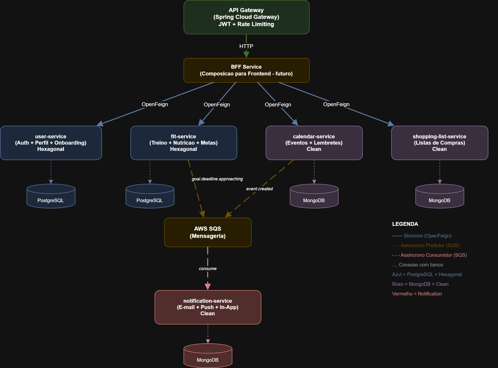

[Uploading fitplanner-communication.drawio.txt…]()
  # 💪 FitPlanner
  
  Sistema baseado em microsserviços para controle completo de treinos, nutrição, metas e rotina de pessoas que praticam musculação.
  
  ---
  
  ## 📋 Índice
  
  - [Visão Geral](#visão-geral)
  - [Arquitetura](#arquitetura)
  - [Microsserviços](#microsserviços)
  - [Stack Tecnológica](#stack-tecnológica)
  - [Comunicação entre Serviços](#comunicação-entre-serviços)
  - [Modelo de Dados](#modelo-de-dados)
  - [Contratos de API](docs/api-contracts.md)
  - [ADRs — Decisões Arquiteturais](#adrs--decisões-arquiteturais)
  - [Como Executar](#como-executar)
  - [Roadmap](#roadmap)
  
  ---
  
  ## Visão Geral
  
  O FitPlanner é uma ferramenta de controle onde **o cliente gerencia tudo**:
  
  - **Cria seus treinos** — divisão, dias, exercícios, com histórico de alterações
  - **Registra sua nutrição** — calorias, macros, refeições, controle de água
  - **Define suas metas** — acompanha progresso manualmente
  - **Organiza seu calendário** — exames, consultas, compromissos
  - **Gerencia listas de compras** — semanal ou mensal
  - **Recebe notificações** — lembretes de metas e eventos
  
  O sistema **não gera planos automaticamente**. O onboarding coleta dados básicos do perfil para referência.
  
  ---
  
  ## Arquitetura
  
  
  
  ---
  
  ## Microsserviços
  
  | Serviço | Responsabilidade | Banco | Arquitetura |
  |---------|-----------------|-------|-------------|
  | **user-service** | Cadastro, perfil, imagem, onboarding, OAuth2, JWT | PostgreSQL | Hexagonal |
  | **fit-service** | Treinos, exercícios, nutrição, água, metas, progresso | PostgreSQL | Hexagonal |
  | **calendar-service** | Eventos, exames, compromissos | MongoDB | Clean simplificada |
  | **shopping-list-service** | Listas de compras semanal/mensal | MongoDB | Clean simplificada |
  | **notification-service** | Notificações (e-mail, push, in-app) | MongoDB | Clean simplificada |
  | **api-gateway** | Roteamento, validação JWT, rate limiting | — | — |
  | **bff-service** | Composição de respostas para frontend (futuro) | — | — |
  
  ---
  
  ## Stack Tecnológica
  
  | Camada | Tecnologia |
  |--------|-----------|
  | Linguagem | Java 21 |
  | Framework | Spring Boot 3.x |
  | Autenticação | Spring Authorization Server + OAuth2 + JWT |
  | Comunicação síncrona | OpenFeign |
  | Mensageria | AWS SQS |
  | Banco relacional | PostgreSQL |
  | Banco documental | MongoDB |
  | Gateway | Spring Cloud Gateway |
  | Documentação API | Swagger / SpringDoc OpenAPI |
  | Containerização | Docker + Docker Compose |
  
  ---
  
  ## Comunicação entre Serviços
  
  ### Síncrona (OpenFeign)
  
  | Origem | Destino | Motivo |
  |--------|---------|--------|
  | bff-service | todos | Composição de telas para frontend |
  
  ### Assíncrona (AWS SQS)
  
  | Produtor | Evento | Consumidor |
  |----------|--------|------------|
  | fit-service | `goal.deadline.approaching` | notification-service |
  | calendar-service | `event.created` | notification-service |
  
  ---
  
  ## Modelo de Dados
  
  Os modelos de entidade-relacionamento detalhados estão nos diagramas:
  
  📎 [`docs/diagrams/`](docs/diagrams/)
  
  ### Resumo por serviço
  
  | Serviço | Entidades principais |
  |---------|---------------------|
  | user-service | `users`, `user_profiles`, `roles`, `user_roles` |
  | fit-service | `workout_splits`, `workout_days`, `exercises`, `exercise_history`, `daily_nutrition_logs`, `meals`, `nutrition_targets`, `goals`,
  `goal_progress` |
  | calendar-service | `events` (MongoDB) |
  | shopping-list-service | `shopping_lists` (MongoDB) |
  | notification-service | `notifications`, `notification_preferences` (MongoDB) |
  
  ---
  
  ## ADRs — Decisões Arquiteturais
  
  ### ADR-001: Comunicação entre Microsserviços
  
  **Status:** Aceita
  
  **Decisão:**
  - OpenFeign para comunicação síncrona (BFF → serviços)
  - AWS SQS para eventos assíncronos (notificações)
  
  ---
  
  ### ADR-002: Arquitetura Hexagonal Seletiva
  
  **Status:** Aceita
  
  **Decisão:**
  - Hexagonal: user-service, fit-service (domínio rico)
  - Clean simplificada: calendar, shopping-list, notification (CRUD)
  
  ---
  
  ### ADR-003: Autenticação e Autorização
  
  **Status:** Aceita
  
  **Decisão:**
  - Spring Authorization Server + OAuth2 integrado ao user-service
  - JWT stateless, validado no API Gateway
  - Roles: `USER`, `ADMIN`
  
  ---
  
  ### ADR-004: Observabilidade
  
  **Status:** Adiada
  
  **Decisão planejada:** Spring Actuator + Micrometer + OpenTelemetry + Logs centralizados
  
  ---
  
  ### ADR-005: API Gateway e BFF
  
  **Status:** Aceita
  
  **Decisão:**
  - Spring Cloud Gateway como gateway
  - BFF separado para composição de respostas ao frontend
  
  ---
  
  ### ADR-006: Consolidação do fit-service
  
  **Status:** Aceita
  
  **Contexto:** Treinos, nutrição e metas pertencem ao mesmo contexto (plano do cliente). Separar em microsserviços distintos geraria comunicação
  desnecessária e overhead de infraestrutura.
  
  **Decisão:** Unificar em um único **fit-service** que resolve tudo internamente com queries locais.
  
  ---
  
  ## Como Executar
  
  ```bash
  git clone https://github.com/seu-usuario/fitplanner.git
  cd fitplanner
  docker-compose up -d
  
  cd user-service
  ./mvnw spring-boot:run
  
  Pré-requisitos:
  
  - Java 21
  - Docker + Docker Compose
  - Maven 3.9+
  ```
  
  Roadmap
  
  - [x] Definição da arquitetura e microsserviços
  - [x] Modelagem de dados (MER/DER)
  - [x] Diagramas de comunicação e sequência
  - [x] Estrutura de pastas
  - [x] ADRs documentadas
  - [x] Contratos de API
  - [ ] Implementação do user-service
  - [ ] Implementação do fit-service
  - [ ] Implementação do calendar-service
  - [ ] Implementação do shopping-list-service
  - [ ] Implementação do notification-service
  - [ ] API Gateway + BFF
  - [ ] Docker Compose completo
  - [ ] Observabilidade (ADR-004)
  - [ ] Frontend
  
  ---
  
  Licença
  
  Este projeto está licenciado sob a MIT License [](https://github.com/Dev-JeanCharles/FitPlanner/blob/develop/LICENSE) .
  
  ---
